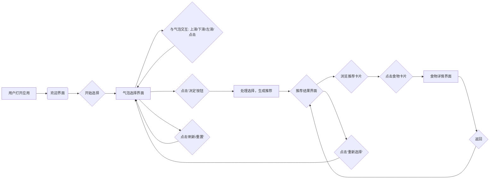

# 《吃什么》应用 - 用户体验(UX)设计文档

## 1. 低保真原型描述

本节描述应用主要界面的核心元素和布局概念。

### 1.1 欢迎界面 (WelcomeView)

- **目的**: 首次启动应用时的介绍和入口。
- **核心元素**:
    - 应用Logo或名称 ("吃什么") - 居中，醒目
    - 简短的应用标语 ("让选择变得简单") - Logo下方
    - "开始选择"按钮 - 屏幕下方，显眼
- **布局**: 简洁，聚焦于引导用户开始。

### 1.2 气泡选择界面 (BubbleSelectionView)

- **目的**: 用户选择偏好的核心交互界面。
- **核心元素**:
    - **气泡区域**: 占据屏幕大部分区域，动态漂浮着各种气泡。
    - **气泡 (Bubble)**: 不同大小、颜色，包含图标和文字（口味、菜系等）。
    - **已选气泡提示区 (可选)**: 屏幕底部或顶部，展示用户已上滑（喜欢）的气泡名称。
    - **"决定"按钮**: 屏幕底部中央，醒目，当有气泡被上滑后激活。
    - **刷新/重置按钮 (可选)**: 屏幕角落，用于重新加载气泡或清空选择。
- **布局**: 动态、充满活力，主要区域留给气泡交互。

### 1.3 推荐结果界面 (RecommendationView)

- **目的**: 展示根据用户选择生成的食物推荐。
- **核心元素**:
    - **标题**: "今天吃这个！" 或类似引导语。
    - **食物卡片列表**: 垂直滚动列表，每张卡片展示一种推荐食物。
        - **食物卡片 (FoodCard)**: 包含食物图片、名称、主要标签（如菜系、口味）、简短描述。
    - **"重新选择"按钮**: 底部，允许用户返回气泡界面。
    - **空状态提示**: 如果没有匹配结果，显示提示信息和返回按钮。
- **布局**: 清晰、信息卡片化，便于浏览和选择。

### 1.4 食物详情界面 (FoodDetailView)

- **目的**: 展示单个食物的详细信息。
- **核心元素**:
    - **食物大图**: 顶部醒目展示。
    - **食物名称**: 图片下方。
    - **评分/喜爱度 (可选)**: 名称旁边或下方。
    - **标签**: 菜系、口味、热量、营养等。
    - **详细描述**: 食材、做法简介等。
    - **相关推荐 (可选)**: 类似的其他食物。
    - **操作按钮 (可选)**: 如"添加到收藏"、"查找附近餐馆"。
    - **返回按钮**: 导航栏或屏幕边缘。
- **布局**: 信息丰富，结构清晰，突出图片和关键信息。

## 2. 气泡交互流程

描述用户与单个气泡的交互细节。

- **初始状态**: 气泡在屏幕上随机漂浮 (布朗运动 + 轻微物理碰撞)。
- **交互触发**: 用户通过手势与气泡互动。
    - **点击 (Tap)**:
        - 选中气泡 -> 气泡外观变化 (如边框高亮)。
        - 再次点击 -> 取消选中，恢复初始外观。
    - **上滑 (Swipe Up)**:
        - 动作: 用户手指向上快速滑动经过气泡。
        - 响应:
            - 气泡被标记为"喜欢"。
            - 气泡向上加速飞出屏幕，伴随缩小/淡出动画。
            - (可选) 在底部"已选气泡区"短暂显示该气泡名称。
            - 对应偏好被记录。
    - **下滑 (Swipe Down)**:
        - 动作: 用户手指向下快速滑动经过气泡。
        - 响应:
            - 气泡被标记为"不喜欢"。
            - 气泡向下加速飞出屏幕，伴随缩小/淡出动画。
            - 对应偏好被记录。
    - **左滑 (Swipe Left)**:
        - 动作: 用户手指向左快速滑动经过气泡。
        - 响应:
            - 气泡被标记为"忽略"。
            - 气泡向左加速飞出屏幕，伴随缩小/淡出动画。
            - 对应偏好被记录（用于避免短期内重复出现）。
- **交互后**: 滑走的或被移除的气泡空位由其他气泡填补或重新生成新的气泡，维持界面动态平衡。

## 3. 用户流程图 (文本形式)

*(注意：以上为Mermaid流程图语法，需在支持Mermaid的Markdown渲染器中查看)*

**文字描述:**
1. 用户打开应用，看到欢迎界面。
2. 点击"开始选择"，进入气泡选择界面。
3. 用户在气泡选择界面与气泡进行交互（上滑、下滑、左滑、点击），此过程可重复。
4. 用户点击"决定"按钮。
5. 系统根据用户的选择生成推荐。
6. 展示推荐结果界面，用户可滚动浏览食物卡片。
7. 用户点击某张食物卡片，进入食物详情界面。
8. 用户从食物详情界面返回，回到推荐结果界面。
9. 用户在推荐结果界面点击"重新选择"，返回气泡选择界面。
10. (可选) 用户在气泡选择界面点击"刷新/重置"，重新加载气泡。

## 4. 交互设计规范

定义手势的具体行为和反馈。

| 手势        | 触发条件                     | 核心行为                      | 视觉反馈                               | 声音反馈 (可选) | 震动反馈 (可选) | 数据记录           |
| ----------- | ---------------------------- | ----------------------------- | -------------------------------------- | --------------- | --------------- | ------------------ |
| **点击**    | 短暂触摸气泡中心区域         | 切换气泡的选中/未选中状态   | 选中时：添加高亮边框或改变背景透明度   | 轻微点击声      | 轻微震动        | 记录选中状态       |
| **上滑**    | 手指从气泡区域向上快速滑动   | 将气泡标记为"喜欢"，移除气泡 | 气泡向上加速飞出，缩小/淡出动画      | "嗖"或肯定音效   | 中等强度震动    | 记录为"喜欢"偏好 |
| **下滑**    | 手指从气泡区域向下快速滑动   | 将气泡标记为"不喜欢"，移除气泡 | 气泡向下加速飞出，缩小/淡出动画      | "噗"或否定音效   | 轻微震动        | 记录为"不喜欢"偏好 |
| **左滑**    | 手指从气泡区域向左快速滑动   | 将气泡标记为"忽略"，移除气泡   | 气泡向左加速飞出，缩小/淡出动画      | "唰"或中性音效   | 轻微震动        | 记录为"忽略"偏好 |
| **拖拽 (长按)** | 长时间按住气泡             | (可选) 拖动气泡位置           | 气泡跟随手指移动，可能有放大或阴影效果 | -               | 轻微持续震动    | -                  |
| **决定按钮点击** | 点击底部"决定"按钮(激活状态) | 触发推荐流程                 | 按钮按下效果，界面可能有加载指示器     | 确认音效        | -               | 触发推荐算法       |

---

**设计原则**:
- **直观性**: 手势含义应符合用户习惯（上=喜欢/确认，下=不喜欢/取消）。
- **反馈及时**: 每次交互都应有明确的视觉、听觉或触觉反馈。
- **流畅性**: 动画效果应自然、不卡顿。
- **容错性**: 允许用户撤销操作或重新选择（如通过刷新按钮）。
- **趣味性**: 气泡的物理效果和交互动画增加使用的乐趣。 